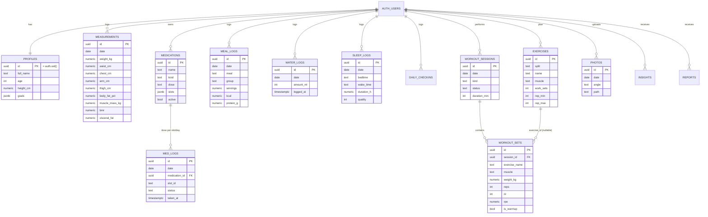

# 03 — ERD

```mermaid
erDiagram
  AUTH_USERS ||--|| PROFILES : has
  AUTH_USERS ||--o{ MEASUREMENTS : logs
  AUTH_USERS ||--o{ MEDICATIONS : owns
  MEDICATIONS ||--o{ MED_LOGS : "dose per slot/day"
  AUTH_USERS ||--o{ MEAL_LOGS : logs
  AUTH_USERS ||--o{ WATER_LOGS : logs
  AUTH_USERS ||--o{ SLEEP_LOGS : logs
  AUTH_USERS ||--o{ DAILY_CHECKINS : logs
  AUTH_USERS ||--o{ EXERCISES : "plan"
  AUTH_USERS ||--o{ WORKOUT_SESSIONS : performs
  WORKOUT_SESSIONS ||--o{ WORKOUT_SETS : contains
  EXERCISES ||--o{ WORKOUT_SETS : "exercise_id (nullable)"
  AUTH_USERS ||--o{ PHOTOS : uploads
  AUTH_USERS ||--o{ INSIGHTS : receives
  AUTH_USERS ||--o{ REPORTS : receives

  PROFILES { uuid id PK "= auth.uid()" text full_name int age numeric height_cm jsonb goals }
  MEASUREMENTS { uuid id PK date date numeric weight_kg numeric waist_cm numeric chest_cm numeric arm_cm numeric thigh_cm numeric body_fat_pct numeric muscle_mass_kg numeric bmr numeric visceral_fat }
  MEDICATIONS { uuid id PK text name text kind text dose jsonb slots bool active }
  MED_LOGS { uuid id PK date date uuid medication_id FK text slot_id text status timestamptz taken_at }
  MEAL_LOGS { uuid id PK date date text meal text group numeric servings numeric kcal numeric protein_g }
  WATER_LOGS { uuid id PK date date int amount_ml timestamptz logged_at }
  SLEEP_LOGS { uuid id PK date date text bedtime text wake_time numeric duration_h int quality }
  EXERCISES { uuid id PK text split text name text muscle int work_sets int rep_min int rep_max }
  WORKOUT_SESSIONS { uuid id PK date date text kind text status int duration_min }
  WORKOUT_SETS { uuid id PK uuid session_id FK text exercise_name text muscle numeric weight_kg int reps int rir numeric rpe bool is_warmup }
  PHOTOS { uuid id PK date date text angle text path }
```
