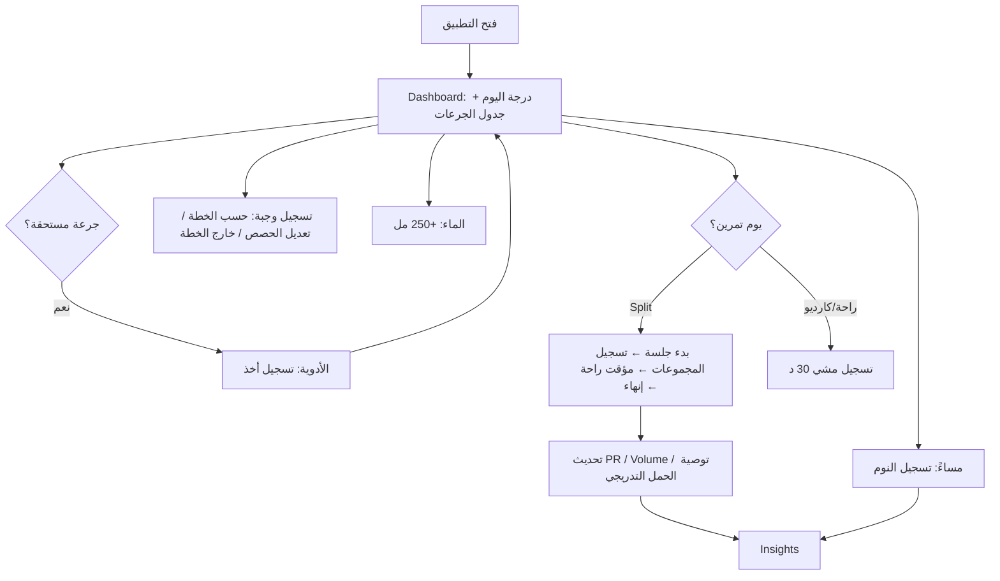
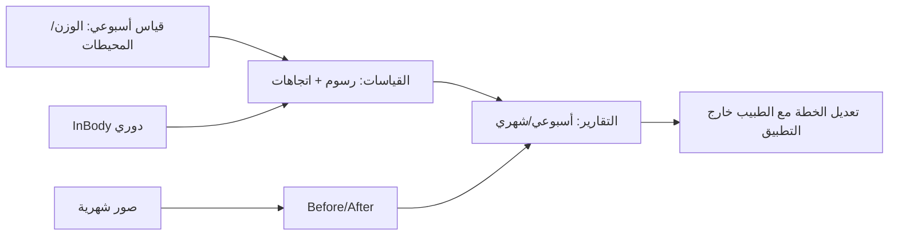

# 05 — User Flows

## يوم نموذجي

```mermaid
flowchart TD
  A[فتح التطبيق] --> B[Dashboard: درجة اليوم + جدول الجرعات]
  B --> C{جرعة مستحقة؟}
  C -- نعم --> D[الأدوية: تسجيل أخذ] --> B
  B --> E[تسجيل وجبة: حسب الخطة / تعديل الحصص / خارج الخطة]
  B --> F[الماء: +250 مل]
  B --> G{يوم تمرين؟}
  G -- Split --> H[بدء جلسة ← تسجيل المجموعات ← مؤقت راحة ← إنهاء]
  G -- راحة/كارديو --> I[تسجيل مشي 30 د]
  H --> J[تحديث PR / Volume / توصية الحمل التدريجي]
  B --> K[مساءً: تسجيل النوم]
  J --> L[Insights]
  K --> L
```

## الأسبوع/الشهر

```mermaid
flowchart LR
  M[قياس أسبوعي: الوزن/المحيطات] --> N[القياسات: رسوم + اتجاهات]
  O[صور شهرية] --> P[Before/After]
  Q[InBody دوري] --> N
  N --> R[التقارير: أسبوعي/شهري]
  P --> R
  R --> S[تعديل الخطة مع الطبيب خارج التطبيق]
```

## تسجيل الدخول (وضع Supabase)
`/` → middleware بلا جلسة → `/login` → email+password → `/`.
